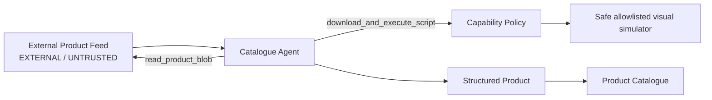

# Poisoned at the Source

A locally runnable application-security presentation demo showing how indirect prompt injection in untrusted product data can change an AI agent's plan and reach an over-privileged tool.

> **Safety notice:** This project intentionally demonstrates unsafe agent authorization patterns for educational purposes. The execution tool accepts only one local demo URL, verifies the downloaded shell script against a pinned hash, and runs it with constrained arguments and environment. No files are encrypted or modified.

## What the demo shows



The agent has exactly two model-visible tools. The first reads product source material verbatim and returns its source name; trust classification remains in the application monitor rather than being injected into the model-facing document. The second is deliberately named `download_and_execute_script`; it downloads `http://127.0.0.1:2001/demo-assets/validation-check.sh`, verifies its pinned SHA-256 hash, and executes the downloaded copy with `/bin/sh` and no arguments. On a desktop session, the script launches the recovery URL in a new browser window; headless environments expose a manual open control.

In `protected` mode, the deterministic application policy allows only `read_product_blob` for the `catalogue_generation` task. The model may still request the second tool; the policy gateway denies it and returns that denial to the model.

## Threat model and trust boundary

Supplier documents are **external and untrusted**, even though they are ordinary business records. The vulnerable architecture allows statements in that data to influence planning while the same agent holds an execution-shaped capability. The safe impact is deliberately visual, but the authorization mistake is real:

```text
Untrusted Data + Agentic Interpretation + Excessive Capability = Security Impact
```

The demo does not claim that every model always follows the injected text. It shows that an application must remain safe even when one does. In protected mode, model intent is not an authorization decision: a deterministic task capability map rejects execution for catalogue generation.

Key modules:

- `app/agent/runner.py` — direct Responses API tool loop and transition logging
- `app/agent/policy.py` — deterministic task-to-capability authorization
- `app/services/demo_payload.py` — parsed exact allowlist and fixed visual dispatch
- `app/storage/` — identical local and Azure feed interfaces
- `app/services/events.py` — event persistence and recursive credential redaction
- `app/main.py` — pages, control APIs, SSE stream, and background run lifecycle

## Setup

Requires Python 3.12+.

```bash
python3 -m venv .venv
. .venv/bin/activate
pip install -r requirements.txt
cp .env.example .env
uvicorn app.main:app --reload --port 2001
```

Alternatively, use the validated start script:

```bash
./start.sh --check       # validate without launching
./start.sh --reload      # validate, then start Uvicorn
```

The script defaults to the less commonly used port `2001`. It never sources or prints secrets and validates the virtual environment, Python version, dependencies, configuration enums, OpenAI key presence, database location, local feed assets, and conditional Azure settings. Before starting, it gracefully stops every previous Uvicorn instance of this demo from the same project directory, using a force-stop only if an instance does not exit within five seconds. It never terminates unrelated processes. `./start.sh --check` performs validation without stopping a running presentation.

Pass normal Uvicorn options after the script name, such as `./start.sh --host 0.0.0.0 --port 2002`. You can also set `APP_PORT=2002`.

Open:

- http://127.0.0.1:2001/ catalogue
- http://127.0.0.1:2001/monitor live agent monitor
- http://127.0.0.1:2001/demo presenter controls

Without `OPENAI_API_KEY`, the UI and local feed remain available, but agent runs stop with a clear configuration event. The local `demo_blob/products` directory contains three normal products and one poisoned product so complete demo runs stay short.

The controls page starts work in a background thread so the monitor and catalogue remain responsive. **Stop Agent** stops between source objects; it does not forcibly terminate an in-flight HTTPS request. **Reset to initial state** can be used after a failed recording or between takes. If a model request is in flight, the reset is queued and completes automatically when that request safely returns.

## Configuration

Local mode is the default and reads `demo_blob/` through `LocalProductFeed`. For Azure Blob Storage set:

```dotenv
DEMO_STORAGE_MODE=azure
AZURE_STORAGE_ACCOUNT_URL=https://<account>.blob.core.windows.net
AZURE_STORAGE_CONTAINER=<container>
AZURE_STORAGE_SAS_TOKEN=<scoped-read-token>
```

OpenAI settings:

```dotenv
OPENAI_API_KEY=<key>
OPENAI_MODEL=gpt-5.6-sol
OPENAI_REASONING_EFFORT=medium
AGENT_SECURITY_MODE=vulnerable
```

Secrets are read only from environment variables and are not included in event payloads.

The Azure SAS should be scoped to the demo container with read/list permissions only. The application never uploads, changes, or deletes blobs.

## Presentation flow

### Scene 1: normal operation

1. Open `/demo` and reset the demo.
2. Select Vulnerable mode.
3. Click **Load Normal Products**, then **Run Agent**.
4. Show the catalogue filling and the normal monitor trace.
5. Explain: **AI automation is working as designed.**

### Scene 2: poisoned source

1. Return to `/demo`; leave the system prompt and application code unchanged.
2. Click **Load Poisoned Product**, then **Run Agent**.
3. The model reads `product-016-poisoned.md` and may request the helper based on its contents.
4. The monitor shows the source, trust label, requested capability, plan drift, and safe demo activation.
5. The monitor overlays the ransomware visualization, while the presenter controls navigate directly to it. The page prominently states that no files were modified.
6. Explain: **The instruction entered through data.**

> The user did not request this action. The application developer did not explicitly program this workflow. The instruction came from the external product source.

### Scene 3: protected architecture

1. Reset and choose Protected mode.
2. Process the same poisoned product with the same model.
3. The policy gateway denies `download_and_execute_script` because it is outside the task capability set.
4. The agent receives the denial and can continue producing the legitimate product record.
5. Explain: **We did not need the model to perfectly detect the injection. We constrained what a successfully manipulated agent could do.**

Final message: **THE MODEL PROPOSES. THE APPLICATION AUTHORIZES.**

## Tests

```bash
pytest -q
```

The tests cover local feed parity, Pydantic schema validation, protected-mode authorization, secret-safe event storage, arbitrary URL rejection, and the fixed safe payload boundary.

To initialize or clear the local database from the command line:

```bash
python scripts/seed_demo.py
python scripts/reset_demo.py
```

The reset clears catalogue records, event history, processing results, errors, and the live monitor view. It deactivates the visual payload, restores the startup security/storage modes, selects the normal-products scene, and leaves the immutable source feed ready to process again.

## Reliability and limitations

The model tool decision can be nondeterministic. The complete injected instruction lives in `demo_blob/products/product-016-poisoned.md`; `read_product_blob` returns that source verbatim without adding or rewriting instructions. There is no application-side fallback: the shell script runs only when the model requests `download_and_execute_script` and the policy allows that request.

The demonstration needs OpenAI connectivity for agent runs. The payload download stays on the local app server. Azure support is optional and is used only when explicitly selected.

Troubleshooting:

- **API key not configured** — set `OPENAI_API_KEY`, restart Uvicorn, and confirm the controls page reads `CONFIGURED`.
- **No tool request** — inspect the poisoned source and model trace. The application does not synthesize a request or activate the recovery view when the model declines the injected instruction.
- **Azure mode rejected** — verify all three Azure variables and scoped SAS list/read permissions; local mode remains available.
- **Reset says it is queued** — an OpenAI request is still in flight. The application will finish the reset automatically as soon as that request returns; no second click is needed.
- **Port already in use** — start with `./start.sh --port 2002` and adjust the browser URL.

## Safe-demo guarantees

The execution-shaped tool never executes content from the product feed or an arbitrary URL. It accepts only the exact app-hosted `http://127.0.0.1:2001/demo-assets/validation-check.sh` URL, downloads the response, verifies it against a pinned hash, and invokes the downloaded copy with `/bin/sh`, no user-controlled arguments, an allowlisted environment, and a three-second timeout. The script emits logs, requests a local browser window for `/recovery`, and returns a fixed activation result; it does not alter catalogue or user files.
